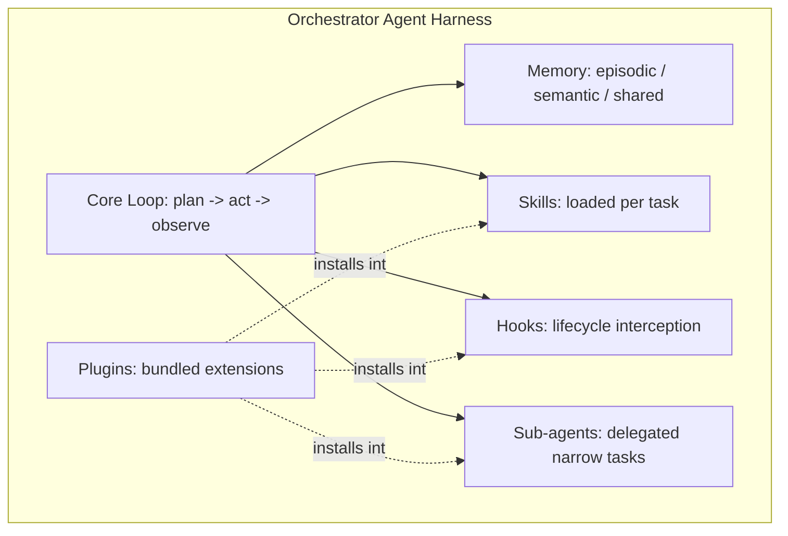

# Agent Harness Design

Extends `team-framework.md`. Each Orchestrator Agent (Requirements/Design/Architecture/Implementation/Test) is not just a prompt-in-prompt-out call — it runs on a **harness** with five components: Memory, Skills, Hooks, Sub-agents, Plugins. This is what makes each agent robust enough to operate autonomously (draft-only) across a shared pool and multiple repos.



---

## 1. Memory

Three tiers, each with a distinct lifetime and store:

| Tier | Scope | Lifetime | Store | Example |
|---|---|---|---|---|
| **Episodic** | One work item | Until `stage:done` | Work Item Queue / state store (already planned in §3 of team-framework.md) | Current draft, revision history, rejection reasons for *this* issue |
| **Semantic** | One team/repo | Persistent | Team memory store (new) | "SR-LKA-004 and SR-LKA-007 were previously merged into one Feature", domain terminology, prior clarification patterns |
| **Shared/cross-team** | Whole pool | Persistent | Rubric-score history store (already planned for Line Manager) | Agent capability trends, common rejection causes across teams |

**Rules:**
- Episodic memory is *always* read before an orchestrator drafts anything for a work item — this is how `changes-requested:*` rework stays consistent with prior attempts instead of drafting from scratch.
- Semantic memory is retrieved selectively (relevance-scored), not dumped wholesale into context — avoids bloating every draft with the team's entire history.
- Line Manager agents are the primary *readers* of the shared tier; orchestrators are the primary *writers* (every completed/rejected draft appends a record).

---

## 2. Skills

Reusable, swappable instruction packages — same pattern as this environment's own `SKILL.md` files. Each skill is a directory with a manifest + supporting files (prompts, rubric YAML, reference docs):

```
agents/architecture_orchestrator/skills/
  iso26262-traceability-review/
    SKILL.md
    rubric.yaml
  autosar-interface-design/
    SKILL.md
    reference/
```

`SKILL.md` front matter:
```yaml
name: iso26262-traceability-review
description: >
  Use when reviewing whether a decomposed Feature preserves ASIL
  classification and traceability back to its source SR.
discipline: architecture
```

**Skill loading is task-triggered, not always-on** — the orchestrator's core loop inspects the work item (labels, discipline, content) and loads only the matching skills, the same way this conversation's own skill-router works. This keeps context lean and keeps skills independently versionable/testable (existing rubric YAMLs become skill payloads rather than a separate concept).

A **Skill Registry** (per team, inheriting from a global catalog) lets a new team stand up fast: e.g. the future AEB team enables `aeb-hazard-analysis` and `autosar-interface-design` without touching orchestrator code.

---

## 3. Hooks

Lifecycle interception points, config-driven so compliance behavior can't be silently bypassed by a prompt change:

| Hook point | Fires | Typical use |
|---|---|---|
| `pre_plan` | Before the orchestrator plans its approach | Load episodic + relevant semantic memory |
| `pre_draft` | Before generating the draft artifact | Load matching skills; enforce required rubric is present |
| `post_draft` | After a draft is produced, before posting | **Mandatory audit log write** (ISO 26262 traceability); rubric scoring |
| `pre_approval_check` | Before checking for `approved:*`/`changes-requested:*` | Verify ASIL-relevant labels/fields aren't missing — block transition if so |
| `post_approval` | After a human approval is consumed | Write to semantic memory; hand off to next orchestrator |
| `on_rejection` | On `changes-requested:*` | Append rejection reason to episodic memory; increment Line Manager's rejection counter |
| `on_escalation` | When a Line Manager flags a capability gap | Notify PM (issue comment / `escalation:line-manager` label) |
| `on_error` | Any unrecoverable agent error | Halt work item at current stage, flag for human triage — never silently retry indefinitely |

Hooks are declared in a `hooks.yaml` at team or repo level, so an **audit-logging hook applies uniformly to every orchestrator in a team**, regardless of what each orchestrator's own prompt says — this is the enforcement layer for ASIL compliance, deliberately kept outside individual agent prompts.

---

## 4. Sub-agents

Orchestrators delegate narrow, well-defined sub-tasks to sub-agents with **isolated context** rather than doing everything in one large reasoning pass. This mirrors the `context-compressor` orchestrator module already planned — the sub-agent's output is compressed/structured before returning to the parent.

Example — `ArchitectureOrchestratorAgent` decomposes into:
- `AUTOSARInterfaceSubAgent` — checks interface consistency against AUTOSAR conventions
- `TraceabilityVerificationSubAgent` — confirms every Feature still traces to a source SR

**Key constraint:** sub-agents have **no approval-gate authority**. Only the parent orchestrator can request human approval or hand off to the next stage — sub-agents only return findings. This keeps the draft-only/human-approves-every-transition rule intact even as agents get more decomposed internally.

Sub-agent manifest is the same shape as the orchestrator manifest (§4 of team-framework.md) minus the `approval_required`/`approval_signal` fields, plus a `parent_discipline` field.

---

## 5. Plugins

A **plugin** bundles skills + hooks + sub-agents + tool/connector definitions into one installable unit, so expanding to a new domain or integration doesn't require touching core agent code.

```yaml
# plugins/iso26262-compliance/plugin.yaml
name: iso26262-compliance
version: 1.0.0
compatible_disciplines: [requirements, design, architecture, test]
provides:
  skills:
    - iso26262-traceability-review
    - iso26262-hazard-analysis
  hooks:
    - post_draft: audit_log_write
    - pre_approval_check: asil_field_guard
  subagents:
    - TraceabilityVerificationSubAgent
  tools: []
```

Planned plugins mapped to your roadmap:
| Plugin | Roadmap tie-in |
|---|---|
| `iso26262-compliance` | Baseline — every team needs this |
| `autosar-toolchain` | AUTOSAR interface work, Architecture discipline |
| `aiag-vda-fmea` | Test Architect risk-based design |
| `aeb-domain` / `acc-domain` | Phase 4 — new ADAS module expansion, reuses all existing orchestrator classes |
| `jira-integration` | Phase 3 — adds a tool connector, no new skills/hooks needed |
| `github-projects-board` | Current interim Jira stand-in |

This is also how the shared orchestrator pool (team-framework.md §7) scales: the same `ArchitectureOrchestratorAgent` class serves the LKA team and, later, the AEB team — just with a different plugin set enabled per team config.

---

## 6. Updated Orchestrator Manifest (supersedes §4 of team-framework.md)

```yaml
# agents/<discipline>/manifest.yaml
name: ArchitectureOrchestratorAgent
discipline: architecture
activities:
  - traceability_review
  - feasibility_check
  - design_boundary_definition
memory:
  episodic_store: work_item_state
  semantic_store: team_memory
  shared_store: rubric_score_history
skills:
  - iso26262-traceability-review
  - autosar-interface-design
hooks_config: hooks.yaml   # team/repo-level, not agent-local
subagents:
  - AUTOSARInterfaceSubAgent
  - TraceabilityVerificationSubAgent
plugins_enabled:
  - iso26262-compliance
  - autosar-toolchain
input_contract: stage_contracts/design_to_architecture.json
output_contract: stage_contracts/architecture_to_implementation.json
approval_required: true
approval_signal: github_label
escalation:
  line_manager_discipline: engineering
max_concurrent_work_items: 3
```

---

## 7. Open Items
- Semantic memory store technology unchosen (vector DB vs. structured key-value) — affects how "relevant" retrieval is scored.
- `hooks.yaml` schema and the enforcement mechanism (i.e., what stops an orchestrator from being deployed without the mandatory `iso26262-compliance` hook set) needs a concrete design — likely a manifest validator that runs at agent-registration time.
- Sub-agent context-compression format needs to match whatever the existing `context-compressor` orchestrator module already expects.
