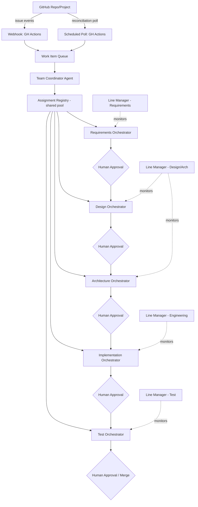

# Multi-Team Orchestrator Framework

Expands `team-structure.md` from "roles for one pipeline" into a framework where **teams of orchestrator agents autonomously execute projects across GitHub repos**, drafting work at every stage while humans approve each stage transition.

**Decisions locked in from clarification:**
- Autonomy = draft-only. Every stage transition (Requirements → Design → Architecture → Implementation → Test → Merge) requires explicit human approval before the next agent proceeds. Non-negotiable for ASIL-rated work.
- Detection = hybrid: GitHub Actions webhook (event-driven) + scheduled reconciliation poll as a backstop.
- Orchestrator agents are a **shared pool**, dynamically assigned across repos/projects rather than bound 1:1 to a repo.

---

## 1. Core Concepts

| Concept | Definition |
|---|---|
| **Orchestrator Agent** | An agent that owns one discipline (Requirements, Design, Architecture, Implementation, Test) end-to-end: it plans its own sub-tasks, invokes tools/sub-agents as needed, and produces a draft artifact + a request for human approval. |
| **Team** | A logical grouping (e.g. "LKA Team") = one orchestrator agent per discipline + a Team Coordinator + one Line Manager per discipline. A Team is assigned to one or more repos/projects. |
| **Team Pool** | The set of all orchestrator agent *instances* across all teams. Since agents are shared, an instance can be reassigned between teams/repos as load changes. |
| **Approval Gate** | The human checkpoint between two stages. An orchestrator cannot hand off its draft to the next orchestrator until a human signals approval. |
| **Work Item** | A GitHub Issue (or a Feature/Story derived from one), tracked through its stage lifecycle inside the framework's state store. |

---

## 2. Architecture



---

## 3. Component Responsibilities

**GitHub Issue Monitor**
- Primary: a GitHub Actions workflow triggered on `issues` and `issue_comment` events (opened, edited, labeled, commented) — near real-time.
- Backstop: a scheduled workflow (e.g. every 15 min) that reconciles state — catches missed webhook deliveries or issues edited while the workflow runner was down.
- Both paths write into the same **Work Item Queue**, so the pipeline logic doesn't care which path triggered it.

**Team Coordinator Agent**
- Reads a Work Item, determines its current stage, and requests the right orchestrator from the Assignment Registry.
- Does **not** replace the human Project Manager — it automates routing/triage; PM retains authority over priority and scope calls.
- Posts stage-transition requests as GitHub comments/labels for human approval.

**Assignment Registry**
- Tracks which orchestrator agent instance is working which (repo, work item) right now, and each instance's current load.
- Assignment policy: skill-match first (discipline required), then least-loaded instance, then repo/team priority as a tiebreaker.
- Because the pool is shared, one `ArchitectureOrchestratorAgent` instance might serve the LKA team in the morning and the AEB team's backlog item in the afternoon.

**Orchestrator Agents (Requirements / Design / Architecture / Implementation / Test)**
- Each wraps and extends the discipline-specific agents already planned (`ProductOwnerAgent`, `ArchitectReviewAgent`, `TestArchitectAgent`, `TestCoverageReviewAgent`) plus a new `ImplementationOrchestratorAgent`.
- Each produces a **draft artifact** (spec, design doc, architecture note, code diff/PR, test plan) — never merges/closes without a human approval event.
- On approval, hands the work item to the next stage's orchestrator via the Team Coordinator.

**Line Manager (per discipline)** — unchanged from `team-structure.md`: out-of-band, reads rubric/review-score history, flags capability gaps. Now also flags **approval-rejection patterns** (e.g. an orchestrator's drafts get rejected repeatedly) as a capability-gap signal.

---

## 4. Orchestrator Agent Skill Manifest (template)

Every orchestrator agent should ship a manifest alongside its `agent.py`/`prompts.py`, so the Team Coordinator and Assignment Registry can reason about it without inspecting code:

```yaml
# agents/<discipline>/manifest.yaml
name: ArchitectureOrchestratorAgent
discipline: architecture
activities:
  - traceability_review
  - feasibility_check
  - design_boundary_definition
tools:
  - rubric: rubrics/iso26262/architecture.yaml
  - reference_docs: standards/autosar/
input_contract: stage_contracts/design_to_architecture.json
output_contract: stage_contracts/architecture_to_implementation.json
approval_required: true
approval_signal: github_label   # github_label | pr_review | issue_comment_command
escalation:
  line_manager_discipline: engineering
max_concurrent_work_items: 3
```

`approval_required: true` is mandatory for every stage in the current design — there's no config path to skip it while ASIL work is in scope.

---

## 5. Approval Gate Mechanics (GitHub-native)

To keep this inspectable by humans without a separate UI:
- Each orchestrator posts its draft as a PR (for Implementation/Test) or a structured Issue comment (for Requirements/Design/Architecture).
- A human approves by applying a label (`approved:requirements`, `approved:design`, etc.) or, for PRs, a standard GitHub review approval.
- The reconciliation poll (§3) is what actually detects the approval label/review and re-enqueues the work item for the next stage — so approval detection reuses the same polling/webhook path as issue detection.

---

## 6. Team Definition (scaling across repos)

```yaml
# teams/lka-team.yaml
team_name: LKA Team
repos:
  - bensonxavier/lka-adas-sample-project
disciplines_required: [requirements, design, architecture, implementation, test]
priority: high
```

Multiple team configs can reference overlapping orchestrator pool instances; the Assignment Registry is what prevents two teams from double-booking the same instance on the same tick.

---

## 7. Updated Role → Agent Mapping (supersedes §5 of team-structure.md)

| Role/Function | Agent Class | Autonomy | Notes |
|---|---|---|---|
| Requirements | `RequirementsOrchestratorAgent` | Draft only | Wraps/extends the SR Analyst + `ProductOwnerAgent` |
| Design | `DesignOrchestratorAgent` | Draft only | Feature → Story boundary drafting |
| Architecture | `ArchitectureOrchestratorAgent` | Draft only | Extends `ArchitectReviewAgent` |
| Implementation | `ImplementationOrchestratorAgent` | Draft only (**new**) | Drafts PRs; human Developer reviews/merges — this is the one change from the earlier "Developer stays human, no agent" position |
| Test | `TestOrchestratorAgent` | Draft only | Merges `TestArchitectAgent` + `TestCoverageReviewAgent` duties |
| Team Coordinator | `TeamCoordinatorAgent` (**new**) | Routing only, no content decisions | Automates PM triage; human PM keeps authority |
| Line Manager (×N disciplines) | `LineManagerAgent(discipline=...)` | Observability only | Unchanged; now also watches approval-rejection rate |
| Project Manager | *(human)* | — | Owns scope/priority calls the Coordinator surfaces |

---

## 8. Open Items
- Need to decide the concrete GitHub label taxonomy for approval gates (`approved:*`) before wiring the webhook workflow.
- `ImplementationOrchestratorAgent` is new scope — its input/output stage contract doesn't exist yet.
- Assignment Registry needs a concrete store (could reuse the same mechanism planned for rubric-score history).
