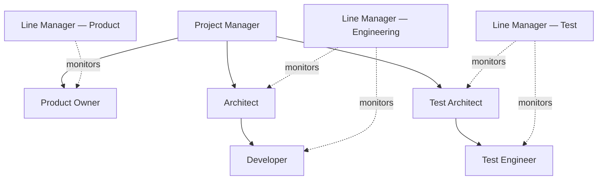

# Team Structure — automotive-sw-development-agents

Companion doc for [Issue #2](https://github.com/bensonxavier/automotive-sw-development-agents/issues/2). Defines the roles that oversee/operate the `requirements-to-userstories` pipeline, their responsibilities, a RACI across pipeline stages, a skill matrix, and a mapping from each role to a future agent class.

This structure is intended to support a scalable, repository-driven operating model in which every team member and agent is expected to be an expert in automotive software development within their assigned role. Each role is therefore associated with explicit skills, experience expectations, and project-specific competency profiles that can be instantiated for a given repository or GitHub project.

---

## 1. Org Chart

Solid lines = delivery/reporting. Dotted lines = Line Manager oversight (capability monitoring, not task direction).

---

## 2. Role Definitions & Responsibilities

### Experience Level Expectations
- All members of the virtual team shall be expected to be experts in automotive software development in their own role capabilities.
- Each role shall have a defined skill profile, experience level, and evidence of competence appropriate to the project context.
- For each project, the team instance shall be assembled from role templates and skill-definition files that are specific to that repository and its requirements.
- At minimum, each critical role should be represented by a senior or lead-level capability for decision-making, review, and escalation, while supporting roles should have a competent practitioner profile.

### Project Manager
- Owns overall pipeline schedule, phase gates (Phase 1–4), and cross-role coordination.
- Tracks stage-contract handoffs between agents/roles; escalates blockers.
- Single point of contact for scope changes to stakeholder requirements (SRs).

### Product Owner
- Owns the SR backlog and Feature backlog; prioritizes what the SR Analyst / Feature Decomposition agent processes next.
- Reviews and approves clarification-request packages (S1.7 output) before they go back to stakeholders.
- Accepts or rejects generated Features prior to story generation.

### Architect
- Owns technical feasibility and design consistency of decomposed Features (traceability to ISO 26262 / ASPICE / AUTOSAR constraints).
- Reviews Feature-to-Story boundaries so stories stay implementable and testable.
- Sets non-functional/architectural rubric criteria used by review agents.

### Developer
- Consumes Jira-ready user stories; implements against acceptance criteria.
- Flags stories that are technically ambiguous or under-specified back to the Architect/Product Owner.

### Test Architect
- Owns test strategy and traceability from Feature → Story → Test Case (AIAG-VDA FMEA-informed risk coverage).
- Defines rubric criteria for "testability" used in story review.

### Test Engineer
- Writes/executes test cases derived from stories; reports coverage gaps.
- Verifies clarification-triggered changes don't break existing traceability.

### Line Manager (per discipline — Product / Engineering / Test)
- **Not part of the delivery chain.** A monitoring role (see §5 for agent-mapping) that tracks capability gaps of the agents/people performing each discipline's work.
- Reviews rubric/review-agent scores over time per role, flags systemic quality drops (e.g., Feature Decomposition agent repeatedly triggering clarification requests it shouldn't need to).
- Owns the "skill upgrade" loop — for agents, this means prompt/rubric refinement or model/version upgrade; for humans, this means training.

---

## 3. RACI Matrix (Pipeline Stages)

| Stage | PM | Product Owner | Architect | Developer | Test Architect | Test Engineer | Line Manager |
|---|---|---|---|---|---|---|---|
| SR Intake & Normalization | A | R | C | – | – | – | I |
| Feature Decomposition (S1.1–S1.7) | I | R | C | – | C | – | I |
| Clarification Request Handling | C | A/R | C | – | – | – | I |
| Feature Review & Approval | I | A | R | – | C | – | I |
| User Story Generation | I | R | C | C | C | – | I |
| User Story Review | I | A | C | C | R | C | I |
| Jira Publish | R | I | – | I | – | I | I |
| Agent Capability Monitoring | I | I | I | I | I | I | R/A |

**R** = Responsible, **A** = Accountable, **C** = Consulted, **I** = Informed.

---

## 4. Skill Matrix & Competency Expectations

| Role | Experience Level Expectation | Core Automotive SW Skills | Tooling | Standards Familiarity |
|---|---|---|---|---|
| Project Manager | Senior/Lead-level experience in program coordination and delivery governance | Program planning, risk escalation, phase-gate control, cross-functional coordination | GitHub Projects, Jira, planning boards | ASPICE (process level) |
| Product Owner | Senior-level experience in requirements and backlog ownership | Requirements analysis, feature prioritization, stakeholder communication, acceptance criteria definition | Jira, GitHub Issues | ASPICE (SYS/SWE), stakeholder mgmt |
| Architect | Senior/Lead-level experience in automotive system/software design | System/software architecture, ADAS domain design, traceability to safety and architecture constraints | AUTOSAR tooling, modeling tools | ISO 26262, AUTOSAR |
| Developer | Practitioners to senior-level, depending on complexity | Embedded/application implementation, testability-aware design, code review, traceability to stories | Python/C, CI/CD, Git | ISO 26262 (SW unit level) |
| Test Architect | Senior-level experience in verification strategy | Risk-based test strategy, traceability design, FMEA-informed coverage planning | Traceability tools | AIAG-VDA FMEA, ISO 26262 (verification) |
| Test Engineer | Practitioner to senior-level experience in test execution | Test case derivation, defect triage, coverage evidence, regression verification | Test frameworks, OpenCV (for LKA fixture) | ISO 26262 (test level) |
| Line Manager | Senior-level experience in team capability management | Skill-gap analysis, rubric interpretation, performance trend monitoring, capability uplift planning | Rubric YAMLs, review-agent dashboards | ASPICE (assessment) |

Each role shall have a role-specific skill-definition file that captures:
- required competencies
- preferred or minimum experience level
- evidence of proficiency
- project-relevant standards and tooling expectations

---

## 5. Project-Based Virtual Team Instantiation & Orchestration

When a new project is established as a GitHub repository, a virtual team instance shall be created for that repository based on the project requirements and the associated issue backlog. The team instance shall include:
- role templates for the required disciplines
- role-specific skill-definition files
- line-manager roles responsible for verifying and evolving those skills over time
- orchestration logic that can plan, monitor, control, and close work through GitHub issues and repository artifacts

### Orchestration Model
1. A master orchestration agent or project manager initiates a new team instance when a repository is assigned to a project.
2. The orchestration agent selects the required roles and loads the relevant skill-definition files for that project.
3. Line-manager agents for each discipline define or refine the skill requirements for their roles and ensure the team instance has the capabilities needed to execute the project successfully.
4. The virtual team is then used to plan work, monitor progress, manage issues, and close project activities as requests are raised through GitHub issues or linked repository tasks.
5. The project manager retains overall control of planning, monitoring, and closure, while role-specific agents support execution, review, and capability oversight.

This model enables the system to create a team instance dynamically for each repository-based project, with role capabilities and skill expectations tailored to that effort rather than relying on a static team composition.

---

## 6. Mapping to Future Agent Classes

| Role | Agent Class (proposed) | Base Class | Status |
|---|---|---|---|
| Product Owner | `ProductOwnerAgent` | `BaseAgent` | Planned — reviews/approves Features |
| Architect | `ArchitectReviewAgent` | `BaseReviewer` | Planned — feasibility/traceability review |
| Test Architect | `TestArchitectAgent` | `BaseAgent` | Planned — test strategy + traceability |
| Test Engineer | `TestCoverageReviewAgent` | `BaseReviewer` | Planned — coverage gap detection |
| Line Manager (×3, one per discipline) | `LineManagerAgent(discipline=...)` | `BaseReviewer` | Future — meta-agent, reads review-agent score history, not part of the main pipeline DAG |
| Project Manager | *(stays human)* | – | Not automated — coordination/escalation role |
| Developer | *(stays human)* | – | Not automated — consumes stories, writes code |

**Line Manager design note:** each instance is scoped to one discipline (Product / Engineering / Test) and takes rubric-score history + review-agent outputs as input, producing a "capability gap report." It does not gate the pipeline — it's an out-of-band observability agent, consistent with the RAG-access guard being enforced at import level for in-pipeline agents.

---

## 7. Open Items for Phase Follow-up
- Exact rubric fields the Line Manager agent consumes aren't defined yet — depends on how `BaseReviewer` scores are persisted today.
- The exact schema for project-specific skill-definition files is still to be defined.
- Whether Project Manager/Developer roles ever get partial automation (e.g. a scheduling assistant) is deferred — out of scope for this issue.
