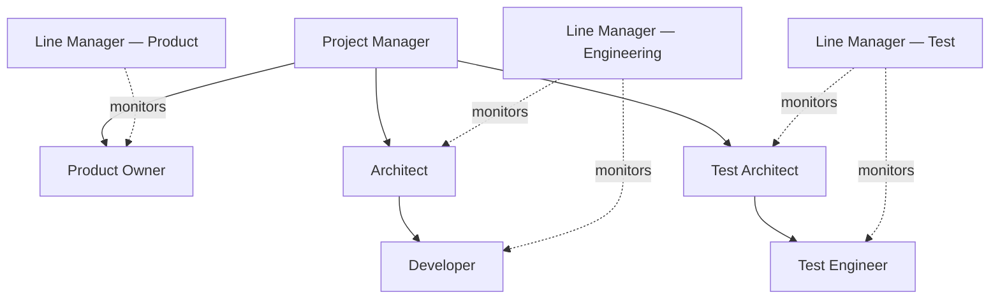

# Team Structure — automotive-sw-development-agents

Companion doc for [Issue #2](https://github.com/bensonxavier/automotive-sw-development-agents/issues/2). Defines the roles that oversee/operate the `requirements-to-userstories` pipeline, their responsibilities, a RACI across pipeline stages, a skill matrix, and a mapping from each role to a future agent class.

---

## 1. Org Chart

Solid lines = delivery/reporting. Dotted lines = Line Manager oversight (capability monitoring, not task direction).

---

## 2. Role Definitions & Responsibilities

### Project Manager
- Owns overall pipeline schedule, phase gates (Phase 1–4), and cross-role coordination.
- Tracks stage-contract handoffs between agents/roles; escalates blockers.
- Single point of contact for scope changes to stakeholder requirements (SRs).

### Product Owner
- Owns the SR backlog and Feature backlog; prioritizes what the SR Analyst / Feature Decomposition agent processes next.
- Reviews and approves clarification-request packages (S1.7 output) before they go back to stakeholders.
- Accepts or rejects generated Features prior to story generation.

### Architect
- Owns technical feasibility and design consistency of decomposed Features (traceability to ISO 26262 / ASPICE / AUTOSAR constraints).
- Reviews Feature-to-Story boundaries so stories stay implementable and testable.
- Sets non-functional/architectural rubric criteria used by review agents.

### Developer
- Consumes Jira-ready user stories; implements against acceptance criteria.
- Flags stories that are technically ambiguous or under-specified back to the Architect/Product Owner.

### Test Architect
- Owns test strategy and traceability from Feature → Story → Test Case (AIAG-VDA FMEA-informed risk coverage).
- Defines rubric criteria for "testability" used in story review.

### Test Engineer
- Writes/executes test cases derived from stories; reports coverage gaps.
- Verifies clarification-triggered changes don't break existing traceability.

### Line Manager (per discipline — Product / Engineering / Test)
- **Not part of the delivery chain.** A monitoring role (see §5 for agent-mapping) that tracks capability gaps of the agents/people performing each discipline's work.
- Reviews rubric/review-agent scores over time per role, flags systemic quality drops (e.g., Feature Decomposition agent repeatedly triggering clarification requests it shouldn't need to).
- Owns the "skill upgrade" loop — for agents, this means prompt/rubric refinement or model/version upgrade; for humans, this means training.

---

## 3. RACI Matrix (Pipeline Stages)

| Stage | PM | Product Owner | Architect | Developer | Test Architect | Test Engineer | Line Manager |
|---|---|---|---|---|---|---|---|
| SR Intake & Normalization | A | R | C | – | – | – | I |
| Feature Decomposition (S1.1–S1.7) | I | R | C | – | C | – | I |
| Clarification Request Handling | C | A/R | C | – | – | – | I |
| Feature Review & Approval | I | A | R | – | C | – | I |
| User Story Generation | I | R | C | C | C | – | I |
| User Story Review | I | A | C | C | R | C | I |
| Jira Publish | R | I | – | I | – | I | I |
| Agent Capability Monitoring | I | I | I | I | I | I | R/A |

**R** = Responsible, **A** = Accountable, **C** = Consulted, **I** = Informed.

---

## 4. Skill Matrix

| Role | Domain Knowledge | Tooling | Standards Familiarity |
|---|---|---|---|
| Project Manager | Program mgmt, phase-gate planning | GitHub Projects, Jira | ASPICE (process level) |
| Product Owner | Requirements analysis, backlog prioritization | Jira, GitHub Issues | ASPICE (SYS/SWE), stakeholder mgmt |
| Architect | System/software architecture, ADAS domain (LKA/AEB/ACC) | AUTOSAR tooling, modeling tools | ISO 26262, AUTOSAR |
| Developer | Embedded/application software dev | Python/C, CI/CD, Git | ISO 26262 (SW unit level) |
| Test Architect | Test strategy, risk-based test design | Traceability tools | AIAG-VDA FMEA, ISO 26262 (verification) |
| Test Engineer | Test execution, defect triage | Test frameworks, OpenCV (for LKA fixture) | ISO 26262 (test level) |
| Line Manager | Quality trend analysis, rubric interpretation | Rubric YAMLs, review-agent dashboards | ASPICE (assessment) |

---

## 5. Mapping to Future Agent Classes

| Role | Agent Class (proposed) | Base Class | Status |
|---|---|---|---|
| Product Owner | `ProductOwnerAgent` | `BaseAgent` | Planned — reviews/approves Features |
| Architect | `ArchitectReviewAgent` | `BaseReviewer` | Planned — feasibility/traceability review |
| Test Architect | `TestArchitectAgent` | `BaseAgent` | Planned — test strategy + traceability |
| Test Engineer | `TestCoverageReviewAgent` | `BaseReviewer` | Planned — coverage gap detection |
| Line Manager (×3, one per discipline) | `LineManagerAgent(discipline=...)` | `BaseReviewer` | Future — meta-agent, reads review-agent score history, not part of the main pipeline DAG |
| Project Manager | *(stays human)* | – | Not automated — coordination/escalation role |
| Developer | *(stays human)* | – | Not automated — consumes stories, writes code |

**Line Manager design note:** each instance is scoped to one discipline (Product / Engineering / Test) and takes rubric-score history + review-agent outputs as input, producing a "capability gap report." It does not gate the pipeline — it's an out-of-band observability agent, consistent with the RAG-access guard being enforced at import level for in-pipeline agents.

---

## 6. Open Items for Phase Follow-up
- Exact rubric fields the Line Manager agent consumes aren't defined yet — depends on how `BaseReviewer` scores are persisted today.
- Whether Project Manager/Developer roles ever get partial automation (e.g. a scheduling assistant) is deferred — out of scope for this issue.
